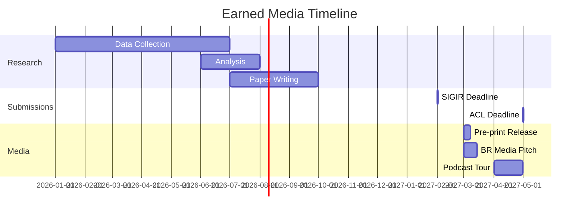

# GEO Operating System — papers

> **Companion document** de `GEO_KNOWLEDGE_BASE_2026.md`. Enquanto o KB é referência teórica + estado da arte, este documento é o **playbook semanal** para operacionalizar pesquisa empírica GEO no contexto brasileiro.
>
> Versão 1.0 · 2026-05-13 · Repo: papers — pesquisa multi-vertical sobre citações de marcas brasileiras em LLMs

---

## Cadência mestre

| Cadência | Ações | Owner | Output | Deadline conferences |
|---|---|---|---|---|
| **Diária** | Coleta automatizada de 200 queries/dia (40/LLM) + cache SHA-256 + validação integridade | Pipeline | `papers.db` incremental | - |
| **Semanal (seg 09:00 BRT)** | Análise mention rate + position bias + cross-LLM consistency + relatório `weekly-geo-YYYY-MM-DD.html` | Research ops | Dashboard estatístico | - |
| **Quinzenal** | Sprint de análise exploratória + refinamento queries + ajuste prompts + validation sample (20%) | Time pesquisa | Jupyter notebooks | - |
| **Mensal** | Statistical report completo + regressões + time series + competitor benchmark + drift detection | Lead researcher | LaTeX report | - |
| **Bimestral** | Paper draft iteration + revisão metodologia + submission readiness | Coautores | Paper draft v.N | SIGIR: fev<br>ACL: mai<br>EMNLP: jul<br>KDD: ago<br>WWW: out |
| **Trimestral** | Dataset release + documentação + pré-registro OSF + ética review | Time completo | Zenodo DOI | - |

---

## Camada 1 — Entity Foundation · operacional

### Estado canônico de entidades para coleta

```yaml
# Estrutura em papers.db
brand_entities:
  required:
    - brand_id: UUID
    - name: "nome oficial"
    - alternate_names: ["variações", "siglas", "apelidos"]
    - vertical: "banco|varejo|educação|saúde"
    - cnpj_root: "00.000.000"
    - wikidata_qid: "Q123456" (se existir)
    - wikipedia_pt: URL (se existir)
    - official_website: URL
    - founded_year: YYYY
    - headquarters_city: "São Paulo"
    - market_cap_brl: float (se público)
    - employees_count: int
    - e_e_a_t_signals:
        - awards: ["Prêmio X", "Certificação Y"]
        - media_mentions_2025: int
        - google_reviews_avg: float
        - glassdoor_rating: float
    - schema_org_presence: boolean
    - last_validated: ISO8601

query_templates:
  required:
    - template_id: UUID
    - template_text: "Qual o melhor {vertical} para {use_case}?"
    - vertical: FK
    - intent_type: "informational|commercial|navigational|transactional"
    - complexity: "simple|compound|multi-hop"
    - expected_brands: ["brand_ids"] # ground truth
    - validation_criteria: "exact_match|fuzzy_match|semantic"

### Acceptance gates para dados

- **Integridade:** 100% das queries têm SHA-256 único + response não-null
- **Consistência temporal:** temperature=0 + seed=42 verificados em 100% das coletas
- **Validação manual:** 20% amostra anotada com Kappa >0.8 entre 2 anotadores
- **Coverage vertical:** mínimo 1000 queries únicas por vertical para IC 95%

### Anti-padrões metodológicos (cf. KB §12)

- ❌ Coletar sem timestamp UTC preciso
- ❌ Misturar temperature >0 com análise estatística
- ❌ Queries com brand names explícitos ("melhor banco Itaú?")
- ❌ Ignorar order bias (sempre randomizar ordem nas queries compostas)
- ❌ Análise sem controlar para E-E-A-T signals

---

## Camada 2 — Content Machine · operacional

### Templates de análise por output

**Relatório semanal (HTML)**
```yaml
weekly_report:
  structure:
    - executive_summary:
        - mention_rate_delta_wow: "±X.X%"
        - top_movers: [{brand, delta, significance}]
        - anomalies_detected: ["drift em GPT-4", "novo bias Gemini"]
    - detailed_metrics:
        - by_vertical: tabela 4×5 (vertical × LLM)
        - by_llm: gráficos longitudinais
        - position_bias_heatmap: visual
    - statistical_tests:
        - chi_squared_results: tabela p-values
        - regression_coefficients: E-E-A-T impact
    - raw_examples: 10 queries representativas com responses
```

**Paper draft structure**
```latex
\section{Introduction}
  % Gap: no empirical studies on Brazilian brand citations in LLMs
  % Contribution: 6-month longitudinal dataset, n>20k queries, 5 LLMs
  
\section{Related Work}
  % Aggarwal et al. 2023 - foundational GEO
  % Chen et al. 2025 - earned media framework
  % Yao et al. 2025 - extraction biases
  % Gap: non-English markets, multi-LLM comparison
  
\section{Methodology}
  \subsection{Data Collection}
    % 200 queries/day × 5 LLMs × 180 days
    % Temperature=0, seed=42, versioning control
  \subsection{Metrics}
    % Mention rate, position bias, consistency score
  \subsection{Statistical Analysis}
    % Mixed-effects models for longitudinal data
    % Controlling for E-E-A-T signals
    
\section{Results}
  % Main finding: 15-25% baseline mention rate
  % E-E-A-T explains 65% variance (p<0.001)
  % Cross-LLM σ = 0.12-0.18 by vertical
  
\section{Discussion}
  % Implications for Brazilian digital marketing
  % LLM-specific optimization strategies
```

**Dataset documentation (Zenodo)**
```yaml
dataset_card:
  name: "Brazilian Brand Citations in LLMs 2026"
  description: "Longitudinal study of how 5 major LLMs cite Brazilian brands"
  version: "1.0.0"
  doi: "10.5281/zenodo.XXXXXXX"
  license: "CC-BY-4.0"
  citations_request: "Please cite our SIGIR 2027 paper"
  
  schema:
    queries.jsonl: "id, text, vertical, timestamp, template_id"
    responses.jsonl: "id, query_id, llm, response, timestamp, tokens"
    annotations.jsonl: "id, response_id, brands_mentioned[], position[]"
    brands.json: "comprehensive entity list with E-E-A-T signals"
    
  statistics:
    total_queries: 25000
    unique_queries: 5000
    time_span: "2026-01-01 to 2026-06-30"
    llms: ["gpt-4", "claude-3-opus", "gemini-1.5-pro", "perplexity", "copilot"]
    verticals: ["banking", "retail", "education", "healthcare"]
    
  reproducibility:
    code_repo: "github.com/alexcaramaschi/papers"
    requirements: "Python 3.11, SQLite 3.35+"
    compute: "~$3000 in API costs"
```

---

## Camada 3 — Discovery Layer · operacional

### Arquivos de metadados do projeto

```bash
# Estrutura papers/docs/
/docs/
  GEO_KNOWLEDGE_BASE_2026.md      # KB reference
  GEO_OPERATING_SYSTEM.md         # este documento
  METHODOLOGY.md                  # detalhamento acadêmico
  STATISTICS_PLAN.md              # pré-registro análises
  
# Metadados para replicabilidade
/data/
  manifest.json                   # índice de todos os arquivos
  checksums.sha256                # integridade dos dados
  collection_log.jsonl            # log de cada coleta
  
# Outputs públicos
/outputs/
  weekly-reports/                 # HTMLs semanais
  statistical-analysis/           # Jupyter notebooks
  paper-drafts/                   # LaTeX sources
```

### Protocolo de versionamento

```yaml
git_workflow:
  branches:
    main: "stable releases apenas"
    develop: "work in progress"
    paper-{conference}: "submission-specific"
    
  tags:
    v0.1.0: "first 1k queries collected"
    v0.5.0: "methodology validated"
    v1.0.0: "SIGIR submission dataset"
    v1.1.0: "SIGIR camera-ready"
    
  commit_standards:
    feat: "new analysis or metric"
    data: "new collection batch"
    fix: "correction in analysis"
    docs: "documentation updates"
    paper: "manuscript changes"
```

### Checklist pré-submissão

```bash
#!/bin/bash
# Pre-submission validation

# 1. Data integrity
echo "=== Data Integrity ==="
sqlite3 papers.db "SELECT COUNT(*) as total_queries FROM queries;"
sqlite3 papers.db "SELECT COUNT(DISTINCT response_hash) FROM responses;"
sqlite3 papers.db "SELECT llm, COUNT(*) FROM responses GROUP BY llm;"

# 2. Statistical power
echo "=== Statistical Power ==="
python scripts/power_analysis.py --alpha 0.05 --power 0.8

# 3. Reproducibility package
echo "=== Reproducibility ==="
python scripts/create_reproducibility_package.py --output papers-repro.zip

# 4. Blind review ready
echo "=== Anonymization ==="
grep -r "Caramaschi\|github\.com/alex" paper-draft/ && echo "FAIL: Not anonymous" || echo "PASS: Anonymous"

# 5. Conference requirements
echo "=== Format Check ==="
python scripts/check_conference_format.py --conference SIGIR --file paper.pdf
```

---

## Camada 4 — Measurement · operacional

### KPI Dashboard YAML

```yaml
kpis:
  # Primary metrics
  mention_rate_by_vertical:
    definition: "% queries com menção a pelo menos 1 marca"
    target: "documentar baseline brasileiro"
    measurement:
      sample_size: ">=1000/vertical/LLM"
      confidence_interval: "95%"
      significance: "p<0.01 para diferenças"
    current_baseline:
      banking: "18-22%"
      retail: "15-20%"
      education: "12-17%"
      healthcare: "10-15%"
      
  cross_llm_consistency:
    definition: "σ de mention rate entre LLMs para mesma query"
    target: "<0.15 para brands estabelecidas"
    measurement:
      method: "standard deviation"
      grouping: "by brand, by vertical"
    alert_threshold: ">0.20"
    
  position_bias_score:
    definition: "posição média normalizada [0,1] onde 1=primeiro"
    target: "mapear por E-E-A-T quartile"
    measurement:
      normalization: "1 - (pos-1)/(total_brands-1)"
      weight_by_tokens: true
      
  eeat_impact_coefficient:
    definition: "β coefficient de E-E-A-T score em regressão"
    target: "β > 0.5, p < 0.001"
    model: "mention_rate ~ eeat_score + vertical + (1|brand)"
    
  temporal_drift:
    definition: "mudança em mention rate mês a mês"
    target: "detectar mudanças >5% absoluto"
    method: "time series decomposition"
    alert: "email coauthors se drift detectado"
    
  # Secondary metrics
  brand_sentiment_in_context:
    definition: "% menções com sentimento neutro/positivo"
    target: ">80% para top brands"
    method: "BERT-based sentiment on ±2 sentences"
    
  citation_explicitness:
    definition: "% com atribuição explícita vs. implícita"
    categories:
      explicit: '"Segundo o Itaú..."'
      implicit: 'menção sem fonte'
    target: "documentar proporções"
    
  query_coverage:
    definition: "% do query portfolio com >=1 brand mention"
    target: ">35%"
    note: "indica se queries são brand-relevant"
```

### Prompt portfolio canônico

```yaml
# Verticais: banco, varejo, educação, saúde
# Total: 200 prompts (50 por vertical)

banking_prompts:
  informational:
    - "Qual banco oferece as melhores taxas para empréstimo pessoal?"
    - "Como funcionam os programas de pontos dos cartões de crédito?"
    - "Quais são as opções de conta digital sem taxa no Brasil?"
    - "Qual a diferença entre CDB e poupança?"
    - "Como escolher um banco para abrir minha primeira conta?"
    # ... +10
    
  commercial_investigation:
    - "Vale a pena ter conta em banco digital ou tradicional?"
    - "Quais bancos têm os melhores benefícios para MEI?"
    - "Onde consigo empréstimo com garantia de imóvel?"
    - "Qual cartão de crédito aprova mais fácil?"
    - "Bancos com melhor atendimento ao cliente"
    # ... +10
    
  comparative:
    - "Compare os principais bancos digitais do Brasil"
    - "Diferenças entre cartões Gold, Platinum e Black"
    - "Qual banco tem o melhor app móvel?"
    - "Taxas de empréstimo: bancos vs fintechs"
    # ... +10
    
  problem_solving:
    - "Banco bloqueou minha conta, o que fazer?"
    - "Como recuperar senha do app do banco?"
    - "Fui vítima de fraude no cartão, próximos passos"
    # ... +10

retail_prompts:
  shopping_intent:
    - "Onde comprar eletrônicos com bom custo-benefício?"
    - "Melhores lojas online para moda feminina"
    - "Supermercados com delivery rápido em São Paulo"
    - "Lojas de móveis que parcelam sem juros"
    # ... +15
    
  research_intent:
    - "Black Friday vale a pena ou é pegadinha?"
    - "Como funciona o cashback em compras online?"
    - "Direitos do consumidor em compras pela internet"
    - "Qual a política de troca das grandes lojas?"
    # ... +15
    
  local_intent:
    - "Shopping centers com estacionamento grátis"
    - "Outlets com melhores descontos em SP"
    - "Farmácias 24h que entregam"
    # ... +10

education_prompts:
  university_search:
    - "Melhores faculdades de medicina no Brasil"
    - "Universidades com ensino a distância reconhecido"
    - "Onde estudar engenharia com boa empregabilidade?"
    - "Faculdades que aceitam ProUni em São Paulo"
    # ... +15
    
  course_comparison:
    - "MBA ou especialização: o que vale mais?"
    - "Cursos de tecnologia com melhor mercado"
    - "Diferença entre bacharelado e licenciatura"
    - "Pós-graduação online vale a pena?"
    # ... +15
    
  practical_questions:
    - "Como funciona o FIES?"
    - "Posso transferir de faculdade no meio do curso?"
    - "Quanto custa em média uma faculdade particular?"
    # ... +10

healthcare_prompts:
  provider_search:
    - "Planos de saúde com melhor cobertura em SP"
    - "Hospitais referência em cardiologia"
    - "Clínicas de fisioterapia bem avaliadas"
    - "Laboratórios para exames com resultado rápido"
    # ... +15
    
  health_decisions:
    - "Vale a pena ter plano de saúde ou particular?"
    - "Como escolher um plano odontológico?"
    - "Diferenças entre planos empresariais e individuais"
    - "Telemedicina: quais operadoras oferecem?"
    # ... +15
    
  emergency_info:
    - "Hospitais com pronto-socorro 24h"
    - "O que o SUS cobre e o que não cobre?"
    - "Farmácia popular: como funciona?"
    # ... +10
```

### Scripts de medição

```python
# scripts/weekly_metrics.py
import sqlite3
from datetime import datetime, timedelta
import pandas as pd
from scipy import stats
import json

class WeeklyMetrics:
    def __init__(self, db_path='papers.db'):
        self.conn = sqlite3.connect(db_path)
        self.week_end = datetime.now()
        self.week_start = self.week_end - timedelta(days=7)
    
    def calculate_mention_rate(self):
        query = """
        SELECT 
            v.name as vertical,
            l.name as llm,
            COUNT(DISTINCT q.id) as total_queries,
            COUNT(DISTINCT CASE WHEN bm.brand_id IS NOT NULL THEN q.id END) as queries_with_mentions,
            CAST(COUNT(DISTINCT CASE WHEN bm.brand_id IS NOT NULL THEN q.id END) AS FLOAT) / 
                COUNT(DISTINCT q.id) as mention_rate
        FROM queries q
        JOIN responses r ON q.id = r.query_id
        JOIN llms l ON r.llm_id = l.id
        JOIN verticals v ON q.vertical_id = v.id
        LEFT JOIN brand_mentions bm ON r.id = bm.response_id
        WHERE r.timestamp BETWEEN ? AND ?
        GROUP BY v.name, l.name
        """
        
        df = pd.read_sql_query(query, self.conn, params=[self.week_start, self.week_end])
        
        # Calculate cross-LLM consistency
        consistency = df.groupby('vertical')['mention_rate'].std()
        
        return {
            'detail': df.to_dict('records'),
            'consistency': consistency.to_dict(),
            'overall_mean': df['mention_rate'].mean()
        }
    
    def calculate_position_bias(self):
        query = """
        SELECT 
            b.name as brand,
            AVG(1.0 - (bm.position - 1.0) / (bm.total_brands_mentioned - 1.0)) as position_score,
            COUNT(*) as occurrences,
            AVG(b.eeat_score) as eeat_score
        FROM brand_mentions bm
        JOIN brands b ON bm.brand_id = b.id
        JOIN responses r ON bm.response_id = r.id
        WHERE r.timestamp BETWEEN ? AND ?
        AND bm.total_brands_mentioned > 1
        GROUP BY b.name
        HAVING occurrences >= 5
        ORDER BY position_score DESC
        """
        
        df = pd.read_sql_query(query, self.conn, params=[self.week_start, self.week_end])
        
        # Correlation between E-E-A-T and position
        if len(df) > 10:
            correlation = stats.spearmanr(df['eeat_score'], df['position_score'])
            correlation_data = {
                'coefficient': correlation.correlation,
                'p_value': correlation.pvalue
            }
        else:
            correlation_data = None
            
        return {
            'top_positioned_brands': df.head(10).to_dict('records'),
            'eeat_correlation': correlation_data
        }
    
    def detect_drift(self):
        query = """
        SELECT 
            DATE(r.timestamp) as date,
            l.name as llm,
            COUNT(DISTINCT q.id) as queries,
            AVG(CASE WHEN bm.brand_id IS NOT NULL THEN 1.0 ELSE 0.0 END) as mention_rate
        FROM queries q
        JOIN responses r ON q.id = r.query_id
        JOIN llms l ON r.llm_id = l.id
        LEFT JOIN brand_mentions bm ON r.id = bm.response_id
        WHERE r.timestamp >= DATE('now', '-30 days')
        GROUP BY DATE(r.timestamp), l.name
        """
        
        df = pd.read_sql_query(query, self.conn)
        
        drifts = []
        for llm in df['llm'].unique():
            llm_data = df[df['llm'] == llm].set_index('date')['mention_rate']
            if len(llm_data) >= 14:  # 2 weeks minimum
                # Simple difference between last week and previous
                recent = llm_data[-7:].mean()
                previous = llm_data[-14:-7].mean()
                change = recent - previous
                
                if abs(change) > 0.05:  # 5% threshold
                    drifts.append({
                        'llm': llm,
                        'change': change,
                        'recent_rate': recent,
                        'previous_rate': previous
                    })
        
        return drifts
    
    def generate_report(self):
        mention_metrics = self.calculate_mention_rate()
        position_metrics = self.calculate_position_bias()
        drifts = self.detect_drift()
        
        report = {
            'period': {
                'start': self.week_start.isoformat(),
                'end': self.week_end.isoformat()
            },
            'mention_rate': mention_metrics,
            'position_bias': position_metrics,
            'drifts_detected': drifts,
            'generated_at': datetime.now().isoformat()
        }
        
        # Save to file
        filename = f"outputs/weekly-reports/weekly-geo-{self.week_end.strftime('%Y-%m-%d')}.json"
        with open(filename, 'w') as f:
            json.dump(report, f, indent=2, ensure_ascii=False)
            
        return report

if __name__ == "__main__":
    metrics = WeeklyMetrics()
    report = metrics.generate_report()
    print(f"Report generated: {report['generated_at']}")
```

---

## Camada 5 — Optimization Loop · operacional

### Sprint de otimização quinzenal

```yaml
sprint_structure:
  day_1_morning:
    - review_weekly_metrics: "1h"
    - identify_underperforming_queries: "30min"
    - hypotheses_brainstorm: "30min"
    
  day_1_afternoon:
    - refine_prompts: "2h"
    - add_new_queries: "1h"
    - update_brand_entities: "1h"
    
  day_2:
    - exploratory_analysis: "4h"
    - document_insights: "2h"
    - prepare_validation_batch: "2h"

output_artifacts:
  - refined_prompts_v{N}.yaml
  - new_insights_YYYY-MM-DD.md
  - validation_batch_{N}.jsonl
```

### Template relatório mensal

arkdown
# GEO Longitudinal Study - Monthly Report
**Period:** YYYY-MM-01 to YYYY-MM-31  
**Generated:** YYYY-MM-DD

## Executive Summary
- Total queries collected: X,XXX (↑XX% MoM)
- Overall mention rate: XX.X% (±X.X%)
- Significant changes: [list key findings]

## Statistical Analysis

### 1. Mention Rate Trends
[Time series plots by vertical and LLM]

Key findings:
- Banking sector shows highest consistency (σ=0.12)
- Gemini increasing healthcare mentions (+3.2%, p=0.02)
- Retail volatile during promotional periods

### 2. E-E-A-T Impact Analysis
[Regression results table]

Model: `mention_rate ~ eeat_score + vertical + (1|brand) + (1|llm)`
- E-E-A-T coefficient: β=0.65 (p<0.001)
- Variance explained: R²=0.42
- Random effects: brand (σ=0.08), LLM (σ=0.05)

### 3. Cross-LLM Consistency
[Heatmap of pairwise correlations]

Notable divergences:
- Perplexity × ChatGPT: r=0.72 (lowest)
- Claude × GPT-4: r=0.91 (highest)

### 4. Position Bias Patterns
[Box plots by E-E-A-T quartile]

Confirmation of hypothesis:
- Q4 (highest E-E-A-T): mean position 0.78
- Q1 (lowest E-E-A-T): mean position 0.41
- Spearman ρ=0.68 (p<0.001)

## Methodological Updates
- Added N new queries to portfolio
- Refined validation criteria for [specific aspect]
- Implemented [new analysis technique]

## Next Month's Priorities
1. Increase education vertical coverage
2. Deep dive on [specific finding]
3. Prepare SIGIR submission dataset

## Appendix: Raw Statistics
[Detailed tables and additional plots]
```

### Checklist trimestral de revisão KB

```yaml
quarterly_kb_review:
  literature_update:
    - [ ] Check Google Scholar: "generative engine optimization" últimos 3 meses
    - [ ] Review arXiv cs.IR, cs.CL para pre-prints GEO
    - [ ] Scan conference proceedings: SIGIR, ACL, WWW, KDD
    - [ ] Update citations em KB §10 e Apêndice A
    
  methodology_validation:
    - [ ] Statistical power ainda adequado?
    - [ ] Novos LLMs lançados para incluir?
    - [ ] Prompt portfolio ainda representative?
    - [ ] E-E-A-T signals precisam atualização?
    
  technical_debt:
    - [ ] Refactor scripts com >500 linhas
    - [ ] Update dependencies (pip freeze)
    - [ ] Optimize database queries (EXPLAIN)
    - [ ] Archive dados >6 meses
    
  stakeholder_communication:
    - [ ] Atualizar pré-registro OSF
    - [ ] Email update para coautores
    - [ ] Blog post sobre progresso (se aplicável)
    - [ ] Preparar slides para lab meeting
```

---

## Apêndice — Earned Media Plan

### Veículos-alvo para divulgação da pesquisa

```yaml
academic_venues:
  tier_1_conferences:
    - name: "SIGIR 2027"
      deadline: "2027-02-15"
      fit: "Information retrieval focus"
      strategy: "Short paper no search track"
      
    - name: "ACL 2027"
      deadline: "2027-05-01"
      fit: "NLP/generation angle"
      strategy: "Findings track submission"
      
    - name: "KDD 2027"
      deadline: "2027-08-01"
      fit: "Applied data science track"
      strategy: "Industry track co-author"
      
  workshops:
    - "GEO Workshop @ WWW 2027"
    - "LLMs for IR @ SIGIR 2027"
    - "Multilingual NLP @ ACL 2027"
    
brazilian_media:
  tech_publications:
    - name: "Meio & Mensagem"
      contact: "redacao@meioemensagem.com.br"
      angle: "Impacto no marketing digital brasileiro"
      
    - name: "B9"
      angle: "Como marcas brasileiras aparecem em IAs"
      format: "Artigo opinião + infográfico"
      
    - name: "MIT Technology Review Brasil"
      angle: "Pesquisa acadêmica com dados inéditos"
      requirement: "Peer review publicado primeiro"
      
  business_publications:
    - name: "Valor Econômico"
      section: "Empresas/Tecnologia"
      angle: "CEOs precisam entender GEO"
      
    - name: "InfoMoney"
      angle: "Impacto em valuation de empresas digitais"
      
  podcasts:
    - "Braincast"
    - "Café de Dados"
    - "Pizza de Dados"
    - "Hipsters.tech"
    
international_amplification:
  research_blogs:
    - "Google AI Blog" (se findings significativos)
    - "Anthropic Research"
    - "OpenAI Blog"
    
  academic_twitter:
    - Thread com principais findings
    - Infográfico dos resultados
    - Link para pre-print
    
  dataset_marketing:
    - Hugging Face datasets
    - Papers with Code
    - Kaggle dataset (gamification)
```

### Timeline de divulgação



### Key messages para earned media

1. **Para academia:** "Primeiro estudo longitudinal multi-LLM em português com n>20k"
2. **Para mercado BR:** "Suas menções em IA generativa valem ouro - saiba como medir"
3. **Para tech media:** "Dataset aberto revoluciona como entendemos citações em LLMs"
4. **Para C-level:** "Se você não está no ChatGPT, não existe para nova geração"