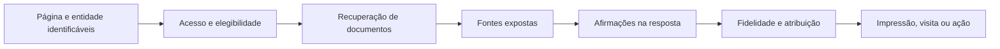

# Como transformar os novos conceitos de SEO e IA em pesquisa verificável

**Revisão:** 10/09/2026. **Público:** quem desenha estudos, interpreta o banco ou escreve os papers. **Natureza:** guia metodológico; exemplos identificados como hipotéticos não são dados do projeto.

## Por que um link e uma menção não provam a mesma coisa?

Imagine uma resposta que nomeia a empresa fictícia de exemplo “Empresa A” e lista uma página com seu nome na URL. O sistema registrou presença textual e uma fonte exposta. Para afirmar que a fonte sustentou a resposta, ainda precisamos verificar se o documento existe, o que dizia na data da captura, qual afirmação ele sustenta e se a resposta preservou suas condições. Uma URL pode conter o nome da empresa no caminho e apontar para uma crítica, um agregador ou um domínio sem relação institucional.

Esse exemplo hipotético atravessa o guia porque reproduz a distinção que a medição precisa respeitar. O termo “citação” é usado para coisas diferentes na literatura de SEO, em respostas generativas e no próprio schema do banco. A tarefa científica começa quando cada uso ganha uma definição que outra pessoa consegue aplicar à mesma observação.

## O que mudou desde a pesquisa fundadora?

Aggarwal e colaboradores formularam um problema de visibilidade em motores generativos e avaliaram intervenções em seu benchmark. A página primária confirma o título, os autores e a aceitação no KDD 2024; a versão v3 é de 28/06/2024. O benchmark oferece desenho e métricas para estudar, mas não revela os pesos de um produto comercial atual. A referência ativa é [GEO: Generative Engine Optimization, arXiv:2311.09735](https://arxiv.org/abs/2311.09735). A entrada antiga da KB misturava a autoria correta com outro DOI; o identificador incompatível saiu da orientação vigente.

A novidade de 2026 é a necessidade de aproximar três corpos de evidência sem fundi-los. As diretrizes de um motor explicam seus requisitos públicos. Painéis comerciais descrevem amostras de páginas, consultas e marcas. O experimento do pesquisador identifica efeitos dentro de uma intervenção, população e instrumento próprios. A pesquisa da Zyppy acrescenta a percepção de profissionais; seu questionário de ranking orgânico pode motivar variáveis, mas não vira coeficiente de um modelo estatístico.

Considere “backlinks” no survey. A pergunta científica não é atribuir ao indicador o percentual de especialistas que o escolheram. É especificar quais links, medidos em qual data, para quais páginas, com que denominador e desfecho. Uma associação entre links e menções pode refletir reputação, idade do domínio, demanda de marca, tipo de conteúdo ou seleção da amostra. Testar a associação continua útil, desde que a conclusão permaneça no alcance do desenho.

## Como funciona a sequência de descoberta até resultado?

A sequência abaixo é um modelo de trabalho para formular perguntas. As setas representam dependências possíveis; não afirmam uma arquitetura interna universal de motores comerciais.

O estudo pode observar uma etapa sem observar a anterior. Um provedor pode devolver texto e nenhuma lista de fontes, embora tenha usado ferramentas. Um modelo paramétrico pode mencionar uma empresa sem busca. Uma impressão em um relatório do Google não informa o conteúdo integral da resposta nem prova que houve visita. A unidade muda ao longo da sequência: página, documento, fonte, afirmação, resposta e evento de usuário.

**Regra para escrever um resultado:** nomear a unidade, a superfície, a janela, a condição de inclusão e o dado ausente antes de calcular a taxa. “Menção detectada em respostas de API sob janela de 200 caracteres” é verificável no instrumento atual; “absorção de autoridade pelo Google” exigiria outro construto e outra observação.

## O que CSR e CAR significam neste código?

A inspeção de [failure_classifier.py](../../../src/collectors/failure_classifier.py) e [citation_tracker.py](../../../src/collectors/citation_tracker.py) mostra o contrato abaixo. São definições locais; reproduzir a sigla de um paper não reproduz automaticamente sua métrica.

| Campo | Cálculo local observado | Interpretação admissível |
|---|---|---|
| `cited` no caminho v2 | NER detecta alguma entidade na janela de `response_text` | Ocorrência lexical conforme aliases e regras do extrator |
| `absorption_status` | Um se `cited` for verdadeiro, zero em caso contrário | Proxy de menção; não verifica apoio da fonte à afirmação |
| `selection_status` | Procura o slug de entidades dentro da string de cada URL em `sources` | Correspondência heurística em fontes expostas; não é log de recuperação |
| Candidatos da seleção | Usa `cited_entities` quando a lista não está vazia; caso contrário, usa a coorte | Não percorre sempre a coorte inteira, apesar de o comentário do helper sugerir isso |
| Ausência de `sources` | Retorna zero na seleção | Zero armazenado pode significar nenhuma correspondência observável; não prova que o motor não consultou fontes |
| `failure_type` | Regras sobre texto, status e argumentos recebidos | Rótulo operacional; causas internas precisam de evidência adicional |

O matching percorre a URL inteira após remover caracteres não alfanuméricos, não um cadastro de domínios verificados. Nomes com menos de três caracteres normalizados são descartados; a normalização não equivale ao NER com aliases e acentos. Pode haver falso positivo por substring e falso negativo por domínio cujo nome difere da entidade.

Há uma assimetria adicional. Se a resposta mencionar Empresa A e a lista de fontes incluir apenas Empresa B, também da coorte, o caminho com `cited_entities` não vazia testa somente A. Não descreva o zero como ausência de qualquer empresa da coorte nas fontes. A proposta P-SEO-05 deve incluir esse caso na validação.

O classificador possui regras que recebem `response_error` e `expected`, mas a chamada inspecionada no citation tracker não fornece esses argumentos. Além disso, um erro com “403” pode gerar o rótulo `blocked-by-robots` no helper, sem provar bloqueio por robots.txt. A existência de uma categoria no enum não demonstra que ela aparece na coleta ou que identifica corretamente a causa. `None` significa ausência de classificação detectada, não resposta validada.

As colunas `citation_selection_rate`, `citation_absorption_rate` e `semantic_entropy_drift` aparecem na migração 0009. A busca de referências em `src/` e `scripts/` não identificou cálculo das duas taxas agregadas. Antes de reportá-las, auditar a extração e os valores efetivos. Esta integração não preenche colunas, reclassifica linhas nem muda o código.

## Como medir seleção, absorção e fidelidade em um estudo novo?

Defina primeiro a observabilidade da superfície. Uma proposta de camada analítica pode distinguir “observado”, “não exposto”, “falha de captura” e “legado sem campo”, mantendo o valor bruto intacto. São estados propostos para uma versão futura, não campos já adicionados ao banco.

Para seleção por entidade, um estudo novo precisaria de cadastro validado de domínios e relações, regras para URLs de terceiros e snapshots da lista exposta. Seu denominador deve ser o conjunto de oportunidades em que a fonte seria observável. Excluir respostas sem fontes sem explicar o motivo pode selecionar precisamente os casos em que o mecanismo se comporta de outra maneira.

Para absorção semântica, a unidade candidata é o par afirmação/fonte. Dois anotadores, sem acesso ao tratamento, classificariam se a fonte sustenta a afirmação, se a relação é parcial, se existe contradição ou se falta material para decidir. A concordância e os desacordos precisam ser reportados; um limiar automático não substitui a inspeção do erro.

A fidelidade acrescenta uma comparação entre a informação original e a resposta. Ela preservou a população estudada, o período, a negação, a condição e a incerteza? Uma resposta pode ter link correto e número correto, mas trocar uma associação por uma causa. Nesse caso, acertou parte da atribuição e falhou na interpretação.

**Desenho candidato de P-SEO-05:** amostrar por provedor, versão, idioma, vertical, status positivo/negativo e disponibilidade de fontes; incluir respostas recusadas e nomes ambíguos. Calcular precisão e sensibilidade separadamente para cada proxy contra a referência anotada. Se os estratos forem sobreamostrados para estudar erros raros, declarar pesos para estimar taxas no painel de origem. Não apresentar uma amostra enriquecida de erros como prevalência populacional.

## Como os conceitos 51 a 63 se tornam variáveis?

Os nomes abaixo são vocabulário interno compartilhado com o `landing-page-geo`. A coluna “operação candidata” sugere um estudo; não afirma que o indicador já existe.

| ID e conceito | Operação candidata | Erro de interpretação a evitar |
|---|---|---|
| 51. Information Gain | Anotar evidência ou informação útil não encontrada em um corpus de comparação definido | Confundir novidade verbal, tamanho do texto ou um nome de patente com ganho causal medido |
| 52. Answer Capsule | Comparar versões que preservam os mesmos fatos e variam a apresentação da resposta direta | Tratar uma contagem de palavras como requisito do Google |
| 53. Compression Fidelity | Contar condições, números e ressalvas preservados por afirmação avaliável | Medir apenas similaridade de embeddings e chamar isso de fidelidade factual |
| 54. Citation Persistence | Repetir consultas e calcular presença por URL/entidade em oportunidades elegíveis | Contar cache como nova geração independente ou ausência de captura como perda de citação |
| 55. Multi-Source Consensus | Agrupar fontes por origem e comparar concordância entre origens independentes | Contar dez republicações do mesmo release como dez confirmações |
| 56. Retrieval Fitness | Em ambiente controlado, avaliar recuperação de documentos relevantes julgados | Afirmar acesso ao índice ou embedding interno de um motor comercial |
| 57. Source Eligibility | Registrar requisitos e controles específicos da superfície na data da observação | Converter elegibilidade em probabilidade garantida de exibição |
| 58. Entity Boundary Drift | Auditar trocas de marca, subsidiária, produto, homônimo e domínio ao longo do tempo | Somar entidades diferentes sob uma marca sem regra prévia |
| 59. Consensus Engine Theory | Formular modelos concorrentes: reputação, fontes independentes, redundância e distribuição | Apresentar uma teoria de trabalho como descrição oficial de todos os motores |
| 60. Query Fan-Out Readiness | Anotar cobertura de subtarefas de um conjunto explícito de consultas | Chamar consultas imaginadas pelo pesquisador de fan-out interno observado |
| 61. Schema Authority Stack | Isolar presença, validade e coerência de tipos de schema em desenho controlado | Atribuir a schema um efeito de conteúdo ou reputação que mudou junto |
| 62. B2A Readiness | Observar sucesso e falhas de tarefas de agentes em fluxo definido | Usar sucesso de navegação como substituto de ranking ou citação |
| 63. Earned Media Primacy | Comparar presença em fontes independentes com demais exposições e desfechos | Transformar correlação de marcas fortes em prova de efeito de assessoria de imprensa |

O conceito 52 aprofunda a fidelidade e o teste das cápsulas já descritas no conceito 11. O 56 operacionaliza uma parte da recuperabilidade do 25. Os IDs não devem ser somados como se representassem dimensões independentes de uma nota de “autoridade de IA”. A taxonomia organiza fenômenos; a independência entre variáveis é uma questão do desenho e dos dados.

## O que o query fan-out ensina para uma revisão de literatura?

Na investigação original, fan-out significou expandir uma pergunta em frentes: publicação e método, sistemas do Google, fontes de IA, tráfego, marca, estrutura e mensuração. As 24 consultas do [registro](registro-query-fan-out.md) documentam esse procedimento. Algumas buscas só serviram para refinar a investigação ou chegar à publicação primária.

No estudo de motores, fan-out descreve outra coisa: consultas relacionadas que o sistema pode emitir para recuperar evidência. A [documentação do Google](https://developers.google.com/search/docs/appearance/ai-features) explica o uso de técnicas desse tipo. Sem um traço exposto, o pesquisador não sabe quais subconsultas ocorreram em uma resposta específica.

Uma aplicação científica é comparar a cobertura das fontes citadas na SERP da consulta original com a cobertura em um conjunto de subtarefas **definido pelo pesquisador**. Essa diferença mede cobertura sob dois referenciais observados. Não reconstrói a trajetória secreta do motor. Outra aplicação é um RAG controlado, no qual se registram as consultas realmente emitidas; seus resultados precisam ser identificados como pertencentes àquele sistema experimental.

A ausência de uma URL no top 10 da consulta original é compatível com múltiplos mecanismos: outra consulta, outra base, indexação em outro momento ou seleção distinta. Sozinha, não demonstra independência entre SEO e busca com IA.

## Por que Jaccard e cobertura dão respostas diferentes?

Considere um exemplo hipotético: o conjunto S tem dez domínios da SERP; L tem quatro domínios de fontes da resposta; dois aparecem em ambos. A interseção contém dois e a união contém 12. Portanto, Jaccard é 2/12, cobertura das fontes da resposta pela SERP é 2/4 e deslocamento é 2/4. São três medidas sobre os mesmos conjuntos com perguntas e denominadores diferentes.

O módulo atual pede dez resultados ao Brave, filtra consultas EN, transforma fontes de IA em conjuntos de domínios e calcula Jaccard, multiplicado por cem em `overlap_pct`. O número de domínios únicos pode ser inferior a dez. Se ambos os conjuntos estiverem vazios, a implementação usa denominador mínimo um e retorna zero; no novo estudo, esse caso precisa ser rotulado como ausência de informação, sem sobrescrever o dado bruto.

O resultado da Ahrefs de março de 2026 usa outro universo: URLs citadas em AI Overviews comparadas com resultados do Google. Seu valor de 37,1% diz respeito aos dez links orgânicos principais no estudo de 863 mil SERPs e cerca de quatro milhões de URLs, conforme [método da Ahrefs](https://ahrefs.com/blog/ai-overview-citations-top-10/). Comparar esse percentual diretamente com o Jaccard de domínios do Brave produziria uma diferença numérica sem significado científico.

O [outline do Paper 2](../../outlines/PAPER_2_GEO_VS_SEO.md) agora distingue essas unidades. Kendall e nDCG dependem de ordem e julgamentos definidos; conjuntos ordenados alfabeticamente no arquivo não são posições de ranking. Regressão beta convencional também não acomoda automaticamente os valores zero e um. O [artigo de Cribari-Neto e Zeileis](https://www.jstatsoft.org/article/view/v034i02) trata a família beta no intervalo aberto; a escolha de modelo deve respeitar o suporte observado.

## Qual é a diferença entre amostra grande e evidência suficiente?

Milhares de linhas podem representar poucas consultas repetidas, respostas reutilizadas do cache, dias incompletos e provedores concentrados em certos períodos. O total de linhas não é o número de unidades independentes. Um desenho precisa declarar o estimando, a menor diferença relevante, a variação esperada, a dependência e o custo de observação.

Para um novo estudo confirmatório, dimensionar a amostra considerando consultas, páginas ou grupos de alocação, em vez de adotar “mil consultas por modelo” ou “cinco mil por vertical” como passe universal. Modelos mistos e erros agrupados não consertam ausência sistemática, tratamento confundido com provedor ou estímulo alterado no meio da série.

Uma regra de convergência pode ajudar a estabilizar um painel exploratório de visibilidade. Ela não autoriza interromper um teste confirmatório quando a estimativa parece favorável ou o p-valor cruza um limiar. Se houver análises sequenciais, o plano precisa especificar o procedimento e suas propriedades antes de executá-las. Na série v2, os critérios existentes permanecem em vigor.

“Não significativo” também não prova equivalência. A demonstração de equivalência exige margens relevantes justificadas e um procedimento apropriado, como explica [Daniel Lakens em Equivalence Testing and Interval Hypotheses](https://lakens.github.io/statistical_inferences/09-equivalencetest.html). O rótulo heurístico `null effect likely` da regra atual não deve ser rebatizado de teste de equivalência. Intervalo posterior de uma análise bayesiana e intervalo de confiança frequentista precisam ser nomeados conforme o método que os produziu.

## Como separar efeito de conteúdo, marca e distribuição?

Uma página com dados originais costuma também receber divulgação, links, melhorias técnicas e novas menções externas. Se tudo mudou junto, um antes/depois mede o pacote, acrescido das mudanças do ambiente. Chamar o resultado de “efeito de schema” ou “efeito da cápsula” perde essa informação.

P-SEO-01 propõe isolar informação original. P-SEO-03 propõe manter os fatos e variar sua apresentação. Em ambos, a alocação pode precisar ocorrer por grupos de páginas para reduzir contaminação por links internos ou reputação compartilhada. Congelar o conteúdo e guardar snapshots antes e depois permite auditar o que foi tratado.

Um grupo comparável no mesmo domínio pode reduzir certas diferenças de base. Não garante causalidade: páginas tratadas podem ter sido escolhidas pela queda recente de tráfego, e o tratamento pode afetar outras páginas. Randomização, quando viável, fortalece a identificação; um desenho observacional exige explicitar seleção, tendências anteriores e interferência. Ajustar indiscriminadamente por toda variável disponível também pode bloquear parte do efeito ou introduzir viés.

Para P-SEO-04, “fonte independente” precisa ser uma propriedade auditável. Duas URLs do mesmo texto sindicado não são duas origens. Separar autor, organização, data, referência original e republicações permite distinguir repetição da mesma mensagem e confirmação por investigações distintas. A tese de primazia de mídia conquistada continua hipótese quando aplicada ao painel brasileiro.

## Como usar os novos relatórios do Google?

O Google anunciou o relatório em 03/06/2026 e registrou distribuição global em 31/08. Ele oferece impressões generativas, com dimensões como página, país, dispositivo e data; essas impressões já pertencem ao total do relatório geral. A disponibilidade global é um fato sobre o produto, não uma medição de qualquer propriedade do `papers`. [Anúncio oficial atualizado](https://developers.google.com/search/blog/2026/06/gen-ai-performance-reports).

O contrato de leitura em 10/09 deve preservar as limitações da [ajuda do relatório](https://support.google.com/webmasters/answer/16984139): não inventar cliques, CTR, consultas ou separação entre AIO e AI Mode a partir da visão dedicada. Não somar impressões generativas ao total Web como incremento. Não converter falta de dado em ausência de exposição, sobretudo quando a exportação representa valores indisponíveis com zero. Comparar a agregação por propriedade no gráfico com a tabela por página exige cuidado.

Para um futuro cruzamento com o painel de APIs, guardar extração, propriedade, filtros, URL canônica, janela e disponibilidade do campo. O cruzamento por data e página não atribui causalidade nem transforma uma resposta de API em uma impressão de Google Search. A interface pública, o endpoint de API, o modelo e as ferramentas de busca são superfícies distintas.

## Qual ficha transforma uma ideia em estudo revisável?

Preencher esta ficha antes de coletar um novo braço. Não existe pré-registro concluído até que o documento, a versão e o momento do registro sejam verificáveis.

| Campo | O que especificar |
|---|---|
| Pergunta e ID | Identificador novo, relação com os conceitos, distinção de H1 a H5 |
| População e unidade | Quais páginas, consultas, entidades, respostas ou pares afirmação/fonte |
| Estimando | Associação ou efeito pretendido, contraste, escala e população de referência |
| Superfície | Provedor, produto, endpoint, modelo devolvido, ferramentas e localidade |
| Tratamento e controle | Mudança isolada, alocação, exposição e possíveis interferências |
| Mensuração | Rubrica, extrator, janela, fontes disponíveis e validação humana |
| Amostra e parada | Justificativa, dependência, calendário, regra de parada e revisões |
| Exclusões | Cache, falha, recusa, dias parciais, probes e desconhecidos |
| Análise | Modelo, incerteza, família de comparações e sensibilidades justificadas |
| Reprodutibilidade | Snapshot, hash, versão de código, protocolo e permissões do material |
| Critério de conclusão | Que resultado sustentaria, enfraqueceria ou deixaria indeterminada a hipótese |

A Empresa A do exemplo inicial só pode ganhar o rótulo de fonte que sustenta uma afirmação depois que essa relação foi observada e avaliada. O valor científico dos conceitos novos está em tornar essa passagem explícita, com espaço para erro, efeito nulo e revisão do instrumento.
